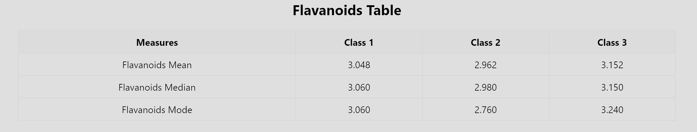
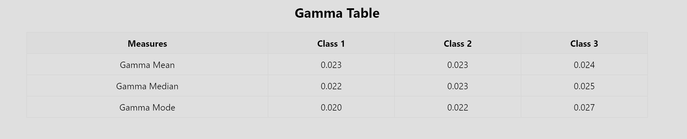

# My Wine Statistics

## Overview

This React application calculates and displays class-wise mean, median, and mode for the "Flavanoids" and "Gamma" properties of the Wine Dataset.

## Screenshots

## Installation

1. Clone the repository.
2. Run `yarn install` to install dependencies.
3. Run `yarn start` to start the development server.

## Evaluation

- **Calculated values**: The calculated values are correct and efficient.
- **Code Quality**: The code is clean, modular, and well-commented.
- **README**: Includes full screenshots of both tables.
